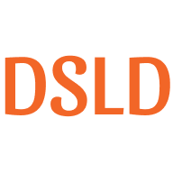
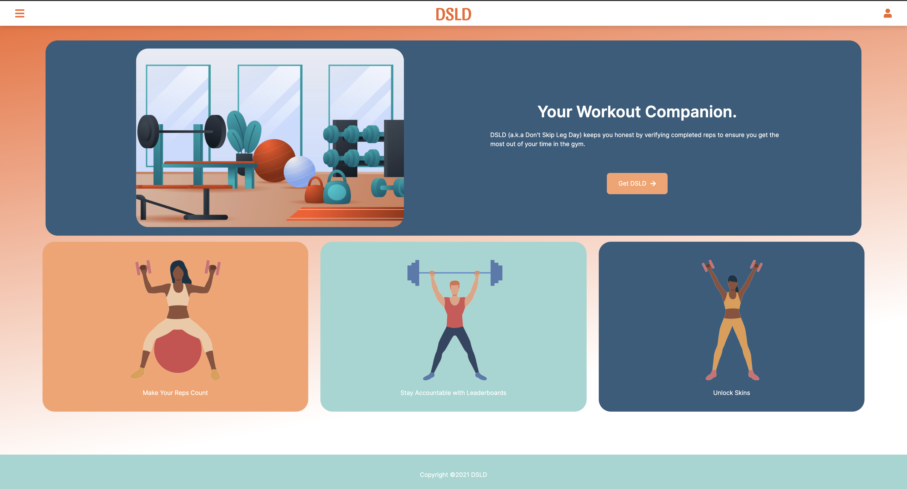
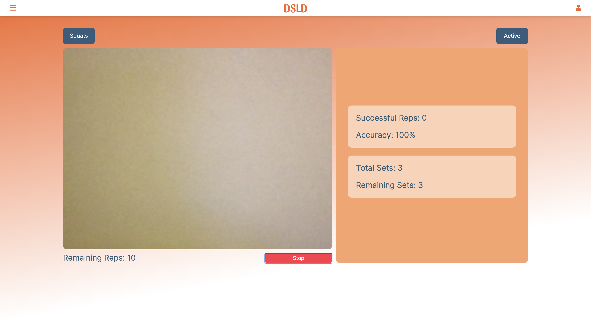
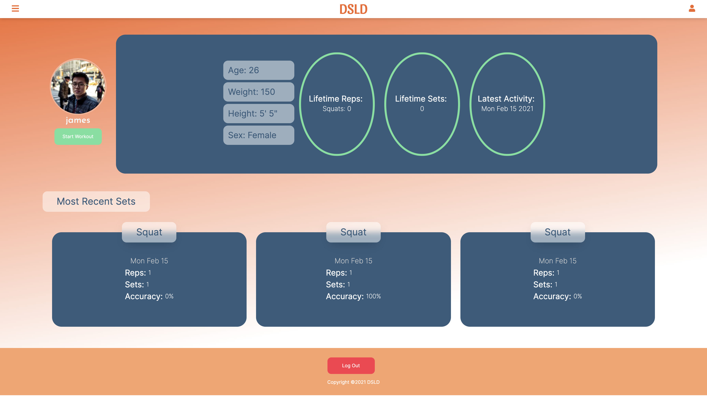

<h1 align="center"></h1>

<h1 align="center">DSLD (Don't Skip Leg Day)</h1>

DSLD (Don’t Skip Leg Day) is a fitness companion that uses computer vision and machine learning to track a user's body position to ensure their posture is correct as they execute a squat. Users can sign up for an account, build their profile, workout and save their workouts to their profile.

 

 

## Contributors

|                                                       [Farhad Siraj](https://www.linkedin.com/in/farhadsiraj/)                                                       |                                                     [Greta Dakers](https://www.linkedin.com/in/greta-dakers/)                                                      |                                                      [James Pan](https://www.linkedin.com/in/james--pan/)                                                       |                                                    [Ricky Rhodes](https://www.linkedin.com/in/rickyrhodes/)                                                     |
| :------------------------------------------------------------------------------------------------------------------------------------------------------------------: | :----------------------------------------------------------------------------------------------------------------------------------------------------------------: | :-------------------------------------------------------------------------------------------------------------------------------------------------------------: | :-------------------------------------------------------------------------------------------------------------------------------------------------------------: |
|  |  |  |  |
|       |       |       |       |
|                                          |                                       |                                      |                                     |

## Table of Contents

- [Getting Started](#getting-started)
- [Stack](#stack)
- [Project Management](#project-management)
- [Author](#authors)
- [Acknowledgements](#acknowledgements)

## Getting Started

- Fork or directly clone this repository to your local machine.
- `cd` into the project directory.
- Run `npm install` to install the project dependencies locally.
- After the dependencies install, `npm run start` to bundle the project and start a local server.
- Navigate to `localhost:1234` in the browser to get DSLD.

## Stack

- [React](https://reactjs.org/)
- [React Router](https://reactrouter.com)
- [Node](https://nodejs.org/en/)
- [Teachable Machine](https://teachablemachine.withgoogle.com)
- [TensorFlow](https://www.tensorflow.org)
- [Firebase (Authentication, Hosting, Cloud Firestore)](https://firebase.google.com)
- [Styled Components](https://www.styled-components.com/)
- [Bootstrap](https://react-bootstrap.github.io/)
- [Cloudinary](https://cloudinary.com)
- [Parcel](https://parceljs.org/)
- [PWA](https://developer.mozilla.org/en-US/docs/Web/Progressive_web_apps)

## Project Management

- Check out our [Github Project Board](https://github.com/2011-FSA-CRAB/DSLD/projects/1) for this project to see what tasks have been completed so far and what still needs to be done.
- Check out our [Figma Wireframes](https://www.figma.com/file/MUgPDDKDsAPVfaPq8Lummo/DSLD?node-id=0%3A1) to see our design process.

## Authors

- [Farhad Siraj](https://www.linkedin.com/in/farhadsiraj/)
- [Greta Dakers](https://www.linkedin.com/in/greta-dakers/)
- [James Pan](https://www.linkedin.com/in/james--pan/)
- [Ricky Rhodes](https://www.linkedin.com/in/rickyrhodes/)

## Acknowledgements

- Thanks to [Fullstack Academy](https://www.fullstackacademy.com/)
- _Huge_ thanks to our amazing team for all of the hard work and dedication over the course of creating this app.

#
